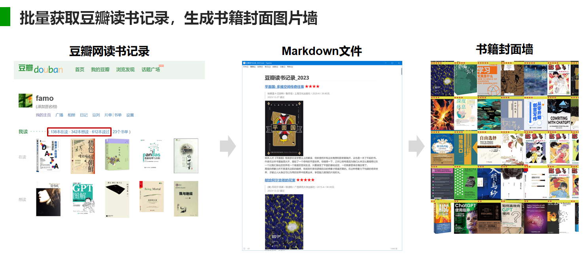
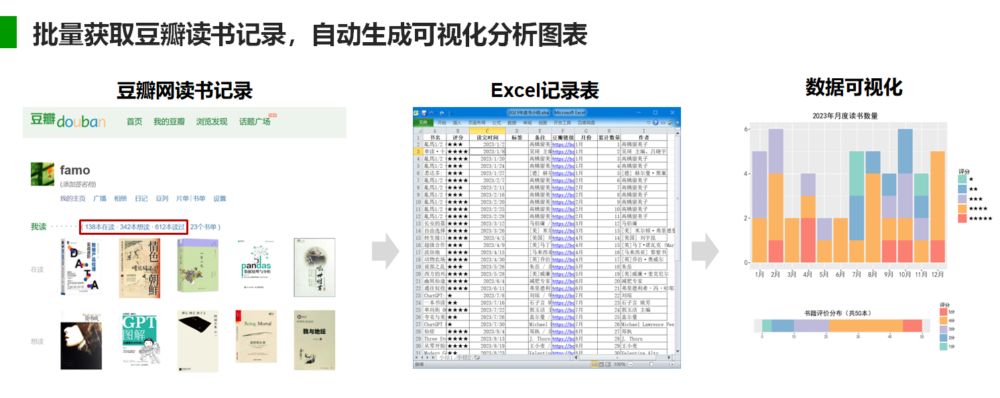
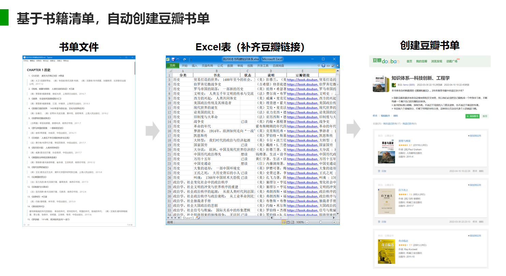

# 豆瓣网读书记录整理自动化脚本

获取“我的”豆瓣读书记录（已读、在读、想读）和短评信息，生成Markdown文档和书籍封面图片墙；基于excel图书列表，自动化创建豆瓣书单；减少手工整理、搜索、添加等操作工作量。

## 主要功能

### 批量获取豆瓣读书记录，生成书籍封面图片墙

- **get_my_douban_books.py:** 批量获取我的豆瓣读书清单及书评（已读、在读、想读），生成Markdown文件；

  根据豆瓣用户ID（不是豆瓣登录用户名！）自动下载获取“我的”豆瓣读书记录（已读、在读、想读）和书评（包括标记时间、评价分数、评论信息），生成包含书籍封面图的Markdown文件；

- **create_bookcover_wall.py:** 基于读书记录Markdown文件，生成书本封面墙（书本封面缩略图拼接）；

### 批量获取豆瓣读书记录，自动生成可视化分析图表

- **年度读书小结.ipynb：**基于读书记录Markdown文件，输出可视化图表；

### 基于图书清单，自动创建豆瓣书单

- **创建豆瓣书单.ipynb：**基于书籍清单Markdown文件中的书籍名称，搜索并补齐每本书的豆瓣链接，自动创建豆瓣书单；

### 其他辅助脚本

- **export_booklist.py:** 根据excel表书单，提取我的豆瓣读书记录（已读、在读、想读）中相关内容，并保存为markdown文件；
- **douban_reading_notes.py:** 根据书籍ID获取豆瓣网上某本书的摘录笔记（无须登录）；
- **md_files_process.py:** Markdown文件批量处理
